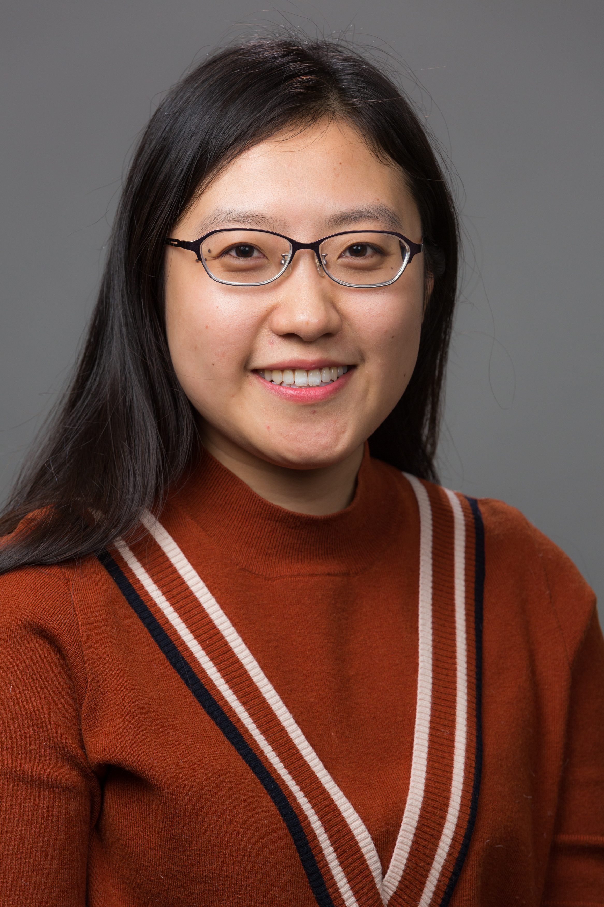

## About Me



I am currently a 5th year PhD student in Institute for Interdisciplinary Information Sciences (IIIS), Tsinghua University. My advisor is [Prof. Jian Li](http://iiis.tsinghua.edu.cn/~jianli/).

Before that, I received the B. Sc degree from Department of Computer Science of China University of Mining Technology.

My research interests includes machine learning, deep learning, and their application in spatio-temporal data.

## Competitions
* No.3 among 1956 teams, Travel Time Estimation Competition (In [DataCastle 2017](http://www.pkbigdata.com/common/cmpt/%E4%BA%A4%E9%80%9A%E7%BA%BF%E8%B7%AF%E9%80%9A%E8%BE%BE%E6%97%B6%E9%97%B4%E9%A2%84%E6%B5%8B_%E6%8E%92%E8%A1%8C%E6%A6%9C.html))
* No.2 among 1648 teams, [Di-tech Algorithm Competition](http://research.xiaojukeji.com/competition/main.action?competitionId=DiTech2016&&locale=en), 2016
* The Most Potential Prize, Di-tech Algorithm Competition, 2016
* Winning prize, National Information Security Competition, 2010
* The second prize, Subei Math Model Competition, 2010

## Experience
* **Research Intern**
	* Didi Chuxing, Bigdata Lab (2015.11-2016.4)

* **Teaching Assistant**
	* IIIS, Tsinghua University, Mathematics for Computer Science (Lecturer: John Steinberg, Spring 2015)
	* IIIS, Tsinghua University, Comprehensive Paper Training (Lecturer: Jian Li, Fall 2014)

## Publications
* When Will You Arrive? Estimating Travel Time Based on Recurrent Neural Networks, **Dong Wang**, Wei Cao, Jian Li (submitted to IJCAI 2017) ([Slides](./talk_slides_tte.pdf))

* [DeepSD: Supply-Demand Prediction for Online Car-hailing Services using Deep Neural Networks](http://iiis.tsinghua.edu.cn/~jianli/paper/ICDE17-deepsd.pdf), **Dong Wang**, Wei Cao, Jian Li, Jieping Ye. In International Conference on Data Engineering (ICDE2017). ([PDF](./DeepSD.pdf)) ([Slides](./talk_slides_deepsd.pdf))

* [Automatic User Identification Method across Heterogeneous Mobility Data Souces]( http://ieeexplore.ieee.org/document/7498306/). Wei Cao, Zhengwei Wu, **Dong Wang**, Jian Li, Haishan Wu. In International Conference on Data Engineering (ICDE2016). ([PDF](./Automatic.pdf))([Slides](./oral.pdf))

* [ETCPS: An Effective and Scalable Traffic Condition Prediction System](https://link.springer.com/chapter/10.1007/978-3-319-32049-6_26), **Dong Wang**, Wei Cao, Mengwen Xu and Jian Li The 21st International Conference on Database Systems for Advanced Applications (DASFAA 2016) ([PDF](./ETCPS.pdf))([Slides](./ETCPS-slides.pdf))

* [DESTPREE: A Data-Driven Approach to Destination Prediction](http://dl.acm.org/citation.cfm?id=2971664), Mengwen Xu, **Dong Wang**, Jian Li. In ACM International Joint Conference on Pervasive and Ubiquitous Computing (UbiComp 2016). ([PDF](./DESTPRE.pdf)) ([Slides](./ubicomp.pdf))

* Social Relationship Detection Based on Sequence to Sequence Learning, **Dong Wang**, Jian Li (under preparation)

* Characterizing Traffic Conditions using Recurrent Neural Networks, **Dong Wang**, Jian Li (under preparation)

## Talks and Slides
* [Learning Algorithms over Massive Spatio-Temporal Data](http://mp.weixin.qq.com/s/vQpDhqDPK6kaVTEC2E0t8A) (SHUFE 2017) ([slides](./talk_slides_wangdong.pdf))
* Traffic Condition Prediction System (UT, Dallas 2016)

## Scholarships
* The third prize scholarship of Tsinghua-Baidu, Tsinghua University, 2015-2016
* The third prize scholarship, Tsinghua University, 2012-2013
* The social work scholarship, Tsinghua University, 2012-2013
* The first prize scholarship, China University of Mining and Technology, for three times, 2009 - 2012

## Contact
**Address:**

```
    Room 4-609, FIT-Building, Tsinghua University
    Beijing, China
```
    
**E-mail:**

```
    wang-dong12 at mails.tsinghua.edu.cn
    wangdong2090 at gmail.com
```


